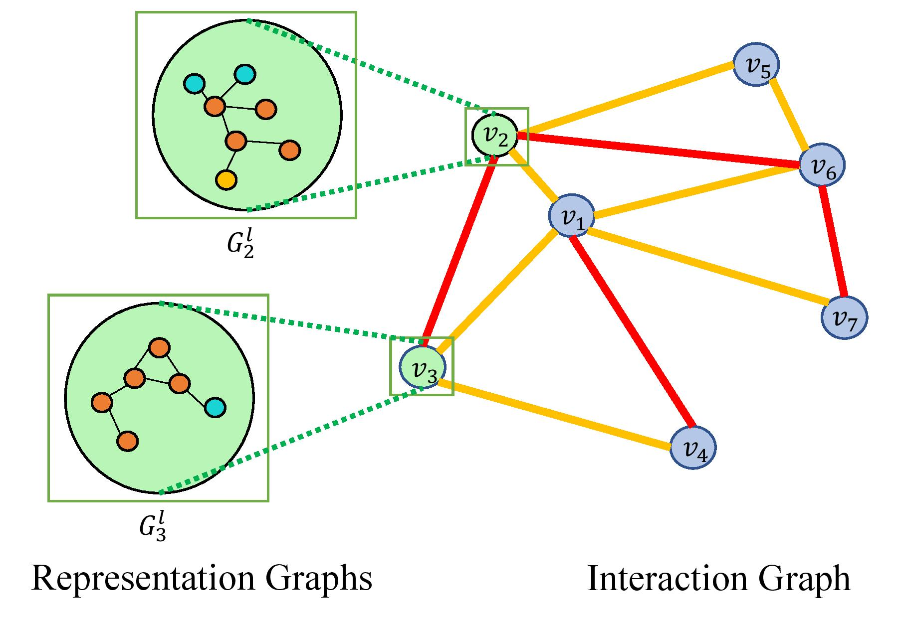

# BiLevel-Graph-Neural-Networks

## Overview
This repo contains the code for Bi-Level Graph Neural Networks for Drug-Drug Interaction Prediction.
For details please refer to the our paper 
> Bi-Level Graph Neural Networks for Drug-Drug Interaction Prediction.
> Yunsheng Bai*, Ken Gu*, Yizhou Sun, Wei Wang.
> ICML 2020 Graph Representation Learning and Beyond (GRL+) Workshop
[\[Paper\]](https://128.84.21.199/abs/2006.14002) [\[Workshop\]](https://grlplus.github.io/).

## Model
  


We introduce Bi-GNN for modeling biological link prediction tasks such as drug-drug interaction (DDI) and protein-protein interaction (PPI). Taking drug-drug interaction as an example, existing methods using machine learning either only utilize the link structure between drugs without using the graph representation of each drug molecule, or only leverage the individual drug compound structures without using graph structure for the higher-level DDI graph. The key idea of our method is to fundamentally view the data as a bi-level graph, where the highest level graph represents the interaction between biological entities (interaction graph), and each biological entity itself is further expanded to its intrinsic graph representation (representation graphs), where the graph is either flat like a drug compound or hierarchical like a protein with amino acid level graph, secondary structure, tertiary structure, etc.


## Usage
### Environment Setup
The code is implemented in python 3.6. The libraries used can be seen in the `Dockerfile`.
To set up the docker environment 
```
$ docker build . -t bilevel_gnn
$ nvidia-docker run -e "HOSTNAME=$(cat /etc/hostname)" -v [path_to_repo]:/workspace -it bilevel_gnn bash
```
There is also an option to use [comet.ml](https://www.comet.ml/) for experiment tracking. 
###Project Navigation
* `data`  contains the raw data for the datasets
* `model` contains pytorch modules for building our model as well as baseline models
* `src` contains the main source code
    * `config.py` is used for all experiment configuration
    * `main.py` is the main script
* `utils` contains utility functions and data processing and loading
* `save` folder (not included in repo) for storing intermediary data klepto objects for faster data loading

### Datasets
The raw data for the `Drugbank` dataset and the `Drugcombo` dataset are available in the `data` folder.
For faster dataloading feel free to download the `BiGNNDataset` klepto objects from 
[google drive](https://drive.google.com/drive/folders/1xOMZuu7b-o4g1sHFliK-vIvNxKeaYaxj?usp=sharing).
Place the files in the `save/dataset` folder. 

### Running the model

Change experiment configurations in `config.py`. If you want to use comet.ml set 
`COMET_ML_API_KEY` to your comet.ml api key and set `YOUR_COMET_PROJECT_NAME` to your comet project name.
You will also want to set `use_comet_ml` to `True`. For example you can change the `model`, `dataset` etc.
 
 After simply run
```
$ cd src && python main.py
```

### Support
If you have any questions about the code or algorithm please reach out to <kengu13@ucla.edu>.